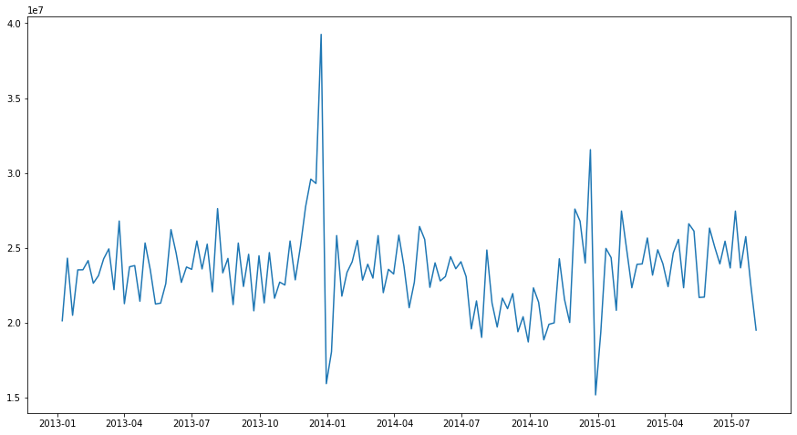
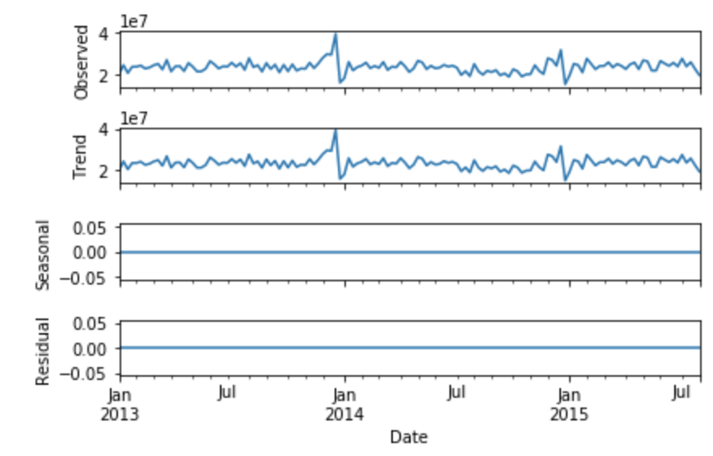
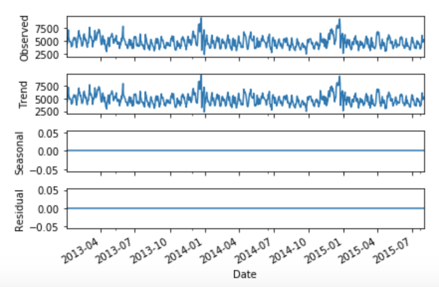
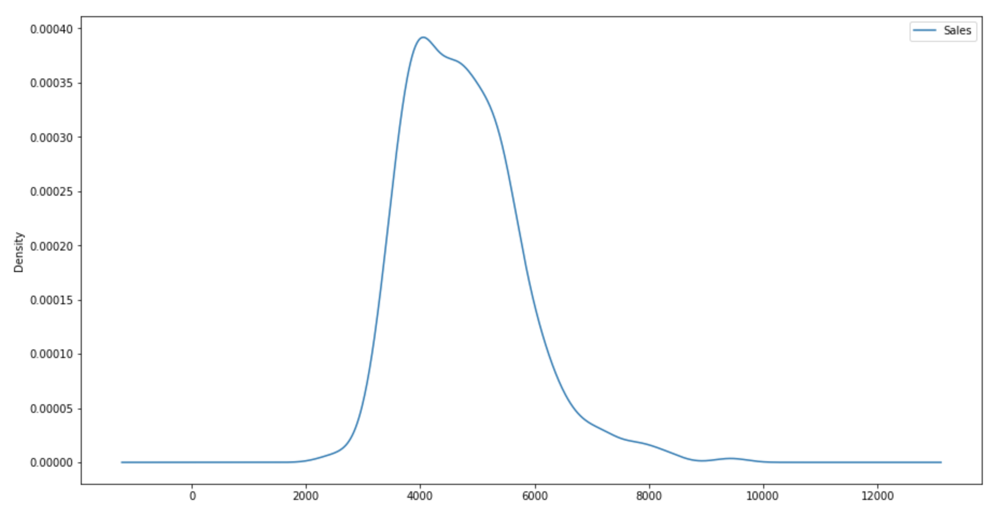
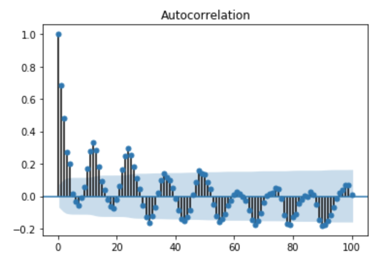
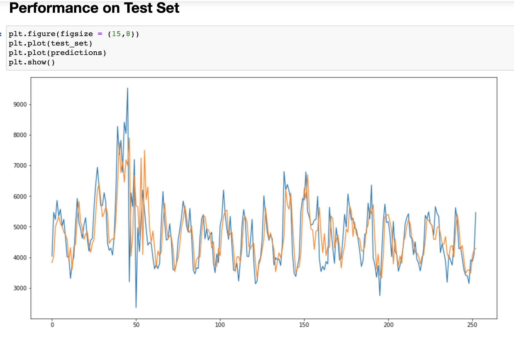
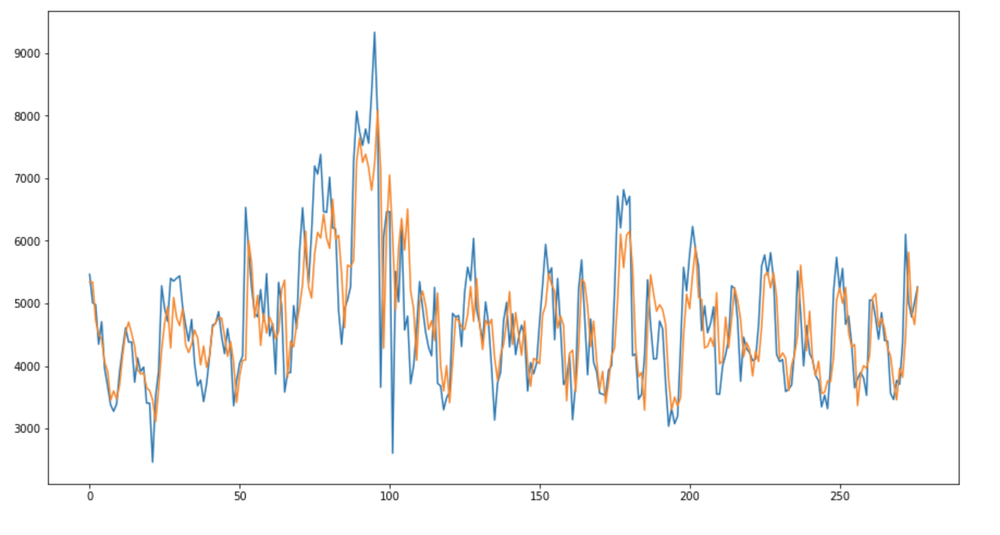

# Time Series Projects

## Projects in Sub Directory
1)  Monthly Armed Robberies in Boston
2) Annual Water usage in Baltimore
3) Monthly Sales Of French Champagne
4) Rossmann Stores

### NOTE : This README Will Dicuss The Following Project :

## Rossmann Stores Forecasting

### Project Goal 

The project's goal is to understand sales distribution by the different store types Rossmann Stores Chain has, and make sales forcasts for Store A and Store C.

### Exploratory Data Analysis

The Analysis was focussed on understanding the following aspects of the stores:

1) Revenue Collection 
2) Summary Statistic of Sales by StoreType
3) Store Operational Days
  1.1) Effect of Holidays : StateHoliday 
  1.2) Effect of Holidays : SchoolHoliday
  1.3) Effect of Promo on Sales by Store

The results of the analysis are as follows : 

#### Revenue Collection  : 

1) Store A makes the maximum sales among all the stores, whereas store B makes the least sales

#### Summary Statistic of Sales by StoreType :

2) Store B makes the highest average sales over the timeframe
3) There is a lot of variability in the sales of Store B
4) The minimum and maximum sales are made by A
5) Store A has the highest number of visitors, and B had the least number of visitors
6) On Average, store B has the highest number of visitors and also had the highest variability
7) Store D had the highest sales/customer followed by A,C and B

#### Store Operational Days : 

8) Store C is closed on the 7th day of the week
9) Store B seems to have made the most sales on Sunday, followed by Store A and lastly by D
10) There is a sharp decline in sales from Saturday to Sunday for both stores A and D

#### Effect of Holidays : StateHoliday

11) Store B earned the maximum on the Public holiday, followed by A, D and C in that order
12) Store B earned the maximum on the Easter holiday, followed by A and D in that order
13) Store B earned the maximum on the Christmas holiday, followed by A and D in that order
14) Store C didn't earn anything on Easter and Christmas holiday

#### Effect of Holidays : SchoolHoliday

15) School's operational hours had some impact on the sales for each store type

#### Effect of Promo on Sales by Store

16) Among all stores , only store D had higher sales when it started Promotional Offer 2, all other sales had higher sales during Promotional Offer 1

### Forecasting Model

The following modelling techniques were used for predicting sales numbers : 

1) Persistence Model
2) ARIMA Model

Methodlogy Followed : Simplified 

The forecasting was was applied and tested at two levels : 

1) Weekly Level sales Data
2) Daily Level Sales Data

### Weekly Level Sales Data : Persistence Model & Grid Search ARIMA [Store A] 

#### Weekly Level Visualization : 

#### ADF Test & Stationarity Analysis

ADF Statistic -10.506582277946958

p Value 1.050461992521558e-18

1% : -3.480118600110386

5% : -2.8833618426136196

10% : -2.578407034974382

#### Observation : 

The ADF statistic is far less than the value at 1% significance level, and thus we can safely reject the null Hypothesis which assumes that the time series is non-stationary, and conclude that we have enough statistical evidence to assume that our time series is stationary

#### Seasonaility & Trend Analysis : 

#### Observation : 

The time series takes all the data as trend, there is seasonality present in the dataset and there is no residual noice present in the dataset either. The current time series is non-stationary and thus for forecasting we'll have to make it stationary, by differencing

#### Testing For Gaussian Distribution 

#### Observation : 

The data seemed gaussian thus no power transformation was applied on the dataset. 

The residuals of the predictions made were further used for bias correction and to reduce the overall residula error of the model. 

Finally to improve over the persistence model, the grid search ARIMA was applied and the resulting residual errors were very high for the model's results to be effectively applied. Hence a change at granularity level ( weekly to daily ) was applied

### Daily Level Sales Data : Persistence Model & Grid Search ARIMA [Store C] 

#### ADF Test & Stationarity Analysis
The ADF Test was again applied on the dataset and the ADF statistic value being lower than the 1% value, resulted in the rejection of the NULL HYpothesis which assumed that the series is non-stationary

ADF Statistic -5.399623337824002

p Value 3.3933795244320705e-06

1% : -3.4389045244994096

5% : -2.8653156040031176

10% : -2.5687805115003

#### Seasonaility & Trend Analysis : 

#### Observation : 

Seasonaility & Trend Analysis didn't return any patterns either and thus any differencing to remove these trends wasn't applied. 

Next, the appplication of the persistene model resulted in better predictions than the Grid Search ARIMA at the weekly level and thus proving a point that daily level data would be a better starting point over weekly level data.

#### Testing For Gaussian Distribution 

#### Observation : 

For daily level data the curve was not gaussian in nature, and thus power transformation's application proved out to be helpful

#### AutoCorrelation & PartialAutocorrelation Plots : p & q values

The Autocorrelation and partial Autocorrelation Plots revealed that p value ranges from 0 to 17 and q value ranges from 0 to 10.

Finally the Grid Search ARIMA was applied on the dataset to improve the base persistence model, and the residual error results
were adjusted back in the model to account for bias correcton and make predictions with minimized residual errors (sales figure) per prediction.

#### Performance On Test Set :

#### Performance on ( Training + Test ) + Validation Set :

